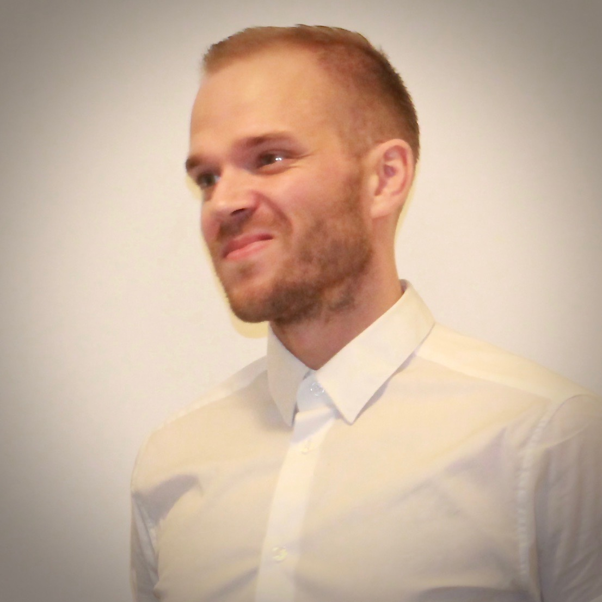

# About us
1. Ívar Kristinn Hallsson  
  * Where you grew up    
  I grew up in Reykjavík.    
  * education and employment history;    
  Grunnskólapróf frá Húsaskóla og stúdentspróf frá Borgarholtsskóla.    
  I work at ÁTVR.    
  * What kind of Software person are you?;  
  Unsure.    
  * What do you expect to get out of this course?;    
  xxxx  
2. Vilhjálmur Rúnar Vilhjálmsson   

  * Where you grew up  
    I grew up here and there but mainly in Seyðisfjörður which is a small town in the east of Iceland.

  * education and employment history;  
    Primary school of seyðisfjörður, matriculation exam from Egilsstaðir upper secondary school, preliminary school Reykjavik University. Employment history is quite diverse, after upper secondary school I worked as a trainer in different sports and as a personal trainer for a few years. After preliminary school I went into the restaurant industry where I f.x. managed a restaurant for few years. After burning out in the restaurant industry I finally start my education in computer science which had been a long time coming. After started focusing more on the software industry I started working for Verifone which is the lead POS terminal manufacturer in the world. From there I realised what type of a software person I am.

  * What kind of Software person are you?;  
    My primary focus is on machine learning algorithms and artificial intelligence either in the financial technology (Fintech) world or for marketing purposes. I also have a great interest in using AI and ML in computer vision. Not a huge fan of UI but do like the occasional design work. I favour building large enterprise systems with a API microservice architecture instead of monolithic system, though I know monolithic system is sometimes the smarter way I just don't like it.

  * What do you expect to get out of this course?;  
    I have seen in a work environment a team with very little development operations and it plain out sucks. The importance of DevOps culture is really great today since we are looking at larger systems and more complex programs/algorithms. Since there are so many tools to use to make the delivery process easier in the long term I think that every programmer should know how to follow a DevOps cultured work style.
